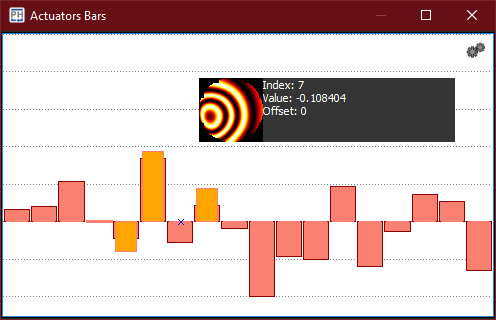

:icons: 
:iconsdir: /icons/

The *actuators bars* widget gives the user a graphical representation of the actual state of the WFC actuators: 

* The *red* bars display the actual WFC output commands;
* The *orange* slimmer bars display the command offsets.

The Y range and baseline are fixed and are determined by the WFC specifications (minimum, maximum and center).

An actuator is *selected* when hovering over its corresponding bar. While hovering, the *preview snippet* shows the numerical values and actuator response of the currently selected actuator index.

{}
The *actuator response* is only shown after the AO system is calibrated.
{}

Within the *actuators bars* widget it is possible to directly control the commands *offset* of the currently selected actuator:

* Clicking the *left* mouse button changes the offset. 
* Clicking the *right* mouse button zeroes the offset. 

{}
It is possible to keep the mouse button *depressed* to keep editing the offset or reset multiple offsets.
{}

{}
The actuators widgets will become enabled once a WFC plugin is succesfully *opened*.
{}

include::content/widgets/bars.adoc[lines=5..-1]
