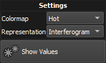

---
_build:
    list: never
---

== Adjusting the bars display

The visualization settings can be accessed by clicking on the *settings* icon:settings[] icon located on the top right of the bars plot. 

[%autowidth]
|===
|Item |Description

|Representation
|Determines how the wavefront relative to the selected bar is displayed into the preview snippet.

|Colormap
|Determines the colormap of the wavefront.
|===