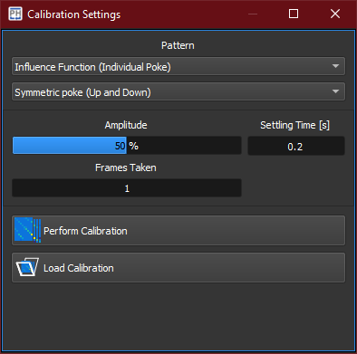

:icons: 
:iconsdir: /icons/

The *calibration settings* widget exposes the parameters used by the AO calibration routine. 

{}
The calibration can only be performed once a *reference* has been taken and a WFC plugin is succesfully *opened*.
{}

== Pattern configuration
=== Poke pattern

[%autowidth]
|===
|Item |Description

|Influence Function (Individual Poke)
|One actuator is poked at once. Useful when the actuators exhibit strong non-linear behaviour.

|Hadamard (Global Poke)
|All actuators are poked at once. Doing so increases the signal to noise ratio, even at lower pattern amplitude.
|===

=== Poke direction

[%autowidth]
|===
|Item |Description

|Symmetric poke (Up and Down)
|The poke is performed in both direction. The minimum of the distance between WFC center and maximum/minimum is taken into consideration to avoid saturation. The result is then averaged.

|Asymmetric poke (Up)
|The poke is performed with positive commands.

|Asymmetric poke (Down)
|The poke is performed with negative commands.
|===

== Parameters

[%autowidth]
|===
|Item |Description

|Ampltude
|Amplitude of the poke pattern. It is relative to the maximum travel of the actuator.

|Settling Time [s]
|Time delay between actuation and measurement. If it is too small, the WFS measurement will be incorrect.

|Frames Taken
|Number of consecutive measurements taken after settling time. The measurement frames are then averaged to improve signal to noise ratio.
|===

== Commands

[%autowidth]
|===
|Item |Description

|icon:wfc_calibration[] Perform Calibration
|Start the calibration routine. The calibration can be stopped by changing the controller status (e.g. zero button).

|icon:im_load[] Load Calibration
|Loads a previously taken calibration from a report folder.
|===

{}
When loading a calibration, the number of WFC actuators must match with the number deduced from the loaded report.
{}
{}
If no reference has been set, loading a calibration will automatically set the previously taken reference. This is beneficial to the reconstructor quality, as no conversion are necessary.
{}