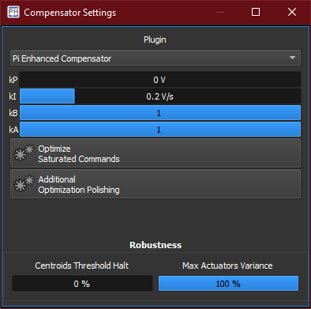

Within the *compensator settings* widget it is possible to choose the *control law*, its parameters and additional *robustness* settings.
Available compensators are listed as xref:../plugins[*plugins*].

== Robustness

These parameters can help avoiding unexpected behaviors from the AO closed loop operations, such as to shut down the loop when the controller is self-oscillating or the sensor image is partially covered.

[%autowidth]
|===
|Item |Description

|Centroids Threshold Halt
|Percentage of the number of detected centroids below which the compensator automatically halts.

|Max Actuators Variance
|Percentage of the actuators variance over time above which the compensator automatically halts.
|===