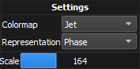

---
_build:
    list: never
---

== Adjusting the image grid display

Clicking with the *right* mouse button pops up the display *settings*:

[%autowidth]
|===
|Item |Description

|Representation
|Determines how the wavefront relative to the selected bar is displayed into the preview snippet.

|Colormap
|Determines the colormap of the wavefront.

|Scale
|Determines the zoom level of the wavefront representation.
|=== 