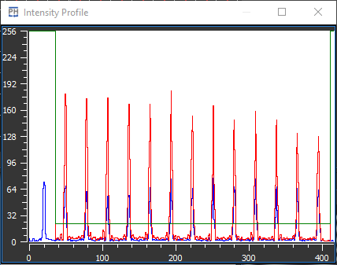

:icons:
:iconsdir: /icons/

The *intensity profile* widget shows the horizontal intensity profile of the *viewfinder image*.
The horizontal line considered in the intensity profile widget can be set using the *cross tool* icon:grid_cross[] in the *viewfinder* widget.

Within the profile plot are shown various items:

* The *blue* curve corresponds to the *intensity* over the horizontal line;
* The *red* curve corresponds to the intensity over the horizontal line that contains the pixel with the *maximum intensity* in each lenslet;
* The *green* curve displays the *pixel threshold* level (set in the TWCoG widget).