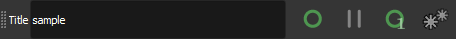
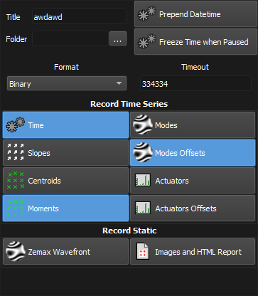

:icons: 
:iconsdir: /icons/

The *log* toolbar manages the logging/reporting utility to save both *dynamic* (real-time) and *static* data to disk.

[%autowidth]
|===
|Item |Description

|Log title
|Title of the log that will appear in the newly generated folder.

|icon:log_start[]
|Starts the log, creating a new folder. To stop the log, press the button again.

|icon:pause[]
|Pauses the log. The *index* counter increments by one.

|icon:log_snapshot[]
|Generates a log with only one sample into a new folder.

|icon:settings[]
|Opens the log settings.
|===

//

== Log Settings

[%autowidth]
|===
|Item |Description

|Folder
|Root folder in which newly generated logs are placed to.

|Prepend Datetime
|Prepends the current date/time to the newly created folders.

|Freeze Time when Paused
|Stops the measured time between pause/start log.

|Format
|Data format. *ASCII* is preferred when an human readable form is needed, otherwise *Binary* is more accurate while minimizing used space.

|Timeout
|If greater than zero, determines the maximum log length in seconds. When the timeout expires, the log is automatically stopped. 

|===

=== Record Time Series/Static

The checkboxes enable/disable saving individual kind of data.

{}
Static data such as AO settings, reconstructor matrices, spot image and centroids are always saved to disk.
{}

With PHOTONLOOP you can save the current measurements and the related settings of the software and also record the measurements for a period of time.

You can set the time for recording in the Timeout specifying the time in seconds. Then check the data that you want to save:

* time in seconds
* slops are the wavefront gradient
* centroids are the x-y positions of spots
* moments
* Zernike are coefficients RMS in meter,
* Zernike offset in meter
* actuators value in normalized voltages
* actuators voltages offset
* wavefront phase to generate a file that can be loaded in Zemax
* html file report.

The saved files contain all the information to generate a report of the measurement and, for example, the centroids_reference.txt can be used to load the measurements grid in a second moment.

To save the report click on the log button image:/img/image45.png[], a new window will open. In this window you can specify the type of data to record, the title of the folder and the saving path. Then press snapshot or record.

image:/img/image46.png[]

== Display the measurements

You can immediately open the report clicking in the Open HTML Report... button in the log window, the browser will automatically start or you can display the report with the HTML file in the saved folder. We recommend Mozilla Firefox as browser. An example of report is in the next figure.

image:/img/image47.png[]

== Load wavefront data as grid phase in Zemax

In this version it is also possible to save a file containing the wavefront data that can be loaded as a Grid Phase map in Zemax 13 and later version. The grid phase file can be saved in the log window, just flag on Generate Wavefront (Zemax) and press on the Snapshot button. The saved folder contains a file wavefront.dat with a series of data like this (units in millimeters):

28 28 0.15 0.15 0 0 0 +
0 0 0 0 1 +
0 0 0 0 1 +
0 0 0 0 1 +
0 0 0 0 1 +
0 0 0 0 1 +
0 0 0 0 1 +
0 0 0 0 1 +
0 0 0 0 1 +
0 0 0 0 1 +
0 0 0 0 1 +
0.620259 0 0 0 +
-0.270376 0 0 0 +
-0.863329 0 0 0 +
-1.19881 0 0 0 +
-1.30754 0 0 0 +
-1.20996 0 0 0

In the first row, the first two numbers (28 in this case) indicate the number of measuring points, 28 by 28 for each side of the grid. 0.15 indicates the pitch in mm of the wavefront sensor. Starting from the second row the table contains the wavefront data. All the rows with zeros that follow are relative to the area of the frame out of the circular aperture, the number 1 in the end of the row indicates that the data point is now valid. The last few rows with a non zero value in the first column are the phase of the wavefront (in radiant). A better description of the file format can be found in the Zemax manual. Note that if you want to refer you wavefront data to the aperture of the optical system you need to consider the magnification factor the relay optics that re-image the aperture into the lenslet array. So, in this case if you want to refer the wavefront data to an aperture of 300 mm in diameter just chance 0.15 mm with 300/28=10.7 mm.

== Load the measurement grid

The measurement grid used for the wavefront measurements is automatically saved with the snapshot button. To load the reference, go into the Utilities tab and then in the Load tab. Press the Load button and chose the folder (note that the Load button is available only if you turn off the button Measure Absolute Wavefront).

If you want to load an image of spots saved with the snapshot and measure it with the saved reference, chose FileSensorVx.x from the Plugin menu in the settings of the WFS, then press the button for camera connection and chose the image to load. Now load the reference and the saved measure will be shown in PHOTONLOOP.

== Playback

In the right part of the log window it is possible to load a Script or a Time series. You can write your own script file that can contains a series of actions that PHOTONLOOP can do during time, this can be useful for automatic measurements.

The time series file that can be loaded contains actuators voltages or RMS Zernike coefficients that can be loaded at a specify frame rate to the deformable elements. A scale factor can be specified for the data in the time series. You can choose also a one-shot time series or loop mode. If you use the option Arm for recording, when you press the Record button, PHOTONLOOP will start the time series and record data in the same time. To run Script or time series just click on the respectively buttons in the bottom part of the window.

== Analyze PHOTONLOOP data with MATLAB

Use the examples in the folder PHOTONLOOP data analysis example in order to upload and display the data.

Launch the program Data_analysis_example.m to upload aberration data (use the data in the folder data_example).

Launch the program Evaluate_Influence_Matrix_Example.m to upload the influence functions (use the data in the folder data_example).