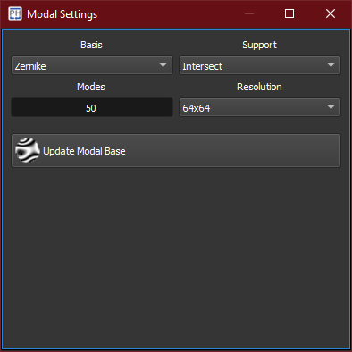

The *modal settings* widget shows the wavefront reconstrutor parameters.

[%autowidth]
|===
|Item |Description

|Basis
a|Selects the basis used to project WFS measurements into modes:

[%autowidth]
!===
!Item !Description

!Zernike !Zernike basis. Indicated for circular apertures;
!Zernike Orthogonal !Basis obtained by orthogonalizing the Zernike basis;
!Legendre !Legendre basis. Indicated for rectangular apertures;
!Legendre Orthogonal !Basis obtained by orthogonalizing the Legendre basis.
!===

|Support
a|Determines the shape of the reconstructed wavefront:

[%autowidth]
!===
!Item !Description

!Standard !The wavefront is shaped like the ideal theoretical shape from the selected basis;
!Reference !The wavefront is shaped with respect to the topology of the detected centroids in the reference;
!Intersect !The wavefront is shaped as the intersection of _Standard_ and _Reference_ shapes. 
!===

|Modes
|Number of modes to consider. A number of modes too large will result in spatial aliasing.

|Resolution
|Image resolution of the wavefront. All the wavefront displayed are affected by this setting.

|Update Modal Base
|Replaces the currently set modal basis with a new one using the currently set parameters.
|===

{}
Setting the modes number too high might result in *spatial aliasing*, i.e. ambiguity in the decomposition.
{}

{}
Large resolution settings will lead to *reduced performance* due to the increase in CPU computation.
{}

{}
The *closed loop* mode is agnostic from the modal settings.
{}