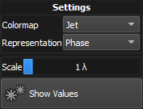

:icons: 
:iconsdir: /icons/

image:modalbars.png[]

The *modal bars* widget gives the user a graphical representation of the actual state of the modal reconstruction: 

* The *green* bars display the measured modes;
* The *light green* slimmer bars display the modal offsets;
* The *red* crosses indicate disabled modes.

A mode is *selected* when hovering over its corresponding bar. While hovering, the *preview snippet* shows the numerical values and mode wavefront representation of the currently selected mode index.

Within the *modes bars* widget it is possible to directly control the modes *offset* of the currently selected mode:

* Clicking the *left* mouse button changes the offset. 
* Clicking the *right* mouse button zeroes the offset. 
* Clicking the *middle* mouse button enables/disables the mode.

{}
It is possible to keep the mouse button *depressed* to keep editing the offset or reset multiple offsets.
{}

== Settings

The *visualization settings* can be accessed by clicking on the icon:settings[] located on the *top right* of the bars plot. 

[%autowidth]
|===
|Item |Description

|Scale
|Scale of the Y axis (in waves).

|Autoscale
|Scales the bars according to the minimum/maximum values.

|Show Values
|Adds a vertical numbered axis on the left of the bars.

|Representation
|Determines how the wavefront relative to the selected bar is displayed into the preview snippet.

|Colormap
|Determines the colormap of the wavefront. 
|===

{}
The modal widgets will become enabled once a *reference* is taken.
{}
