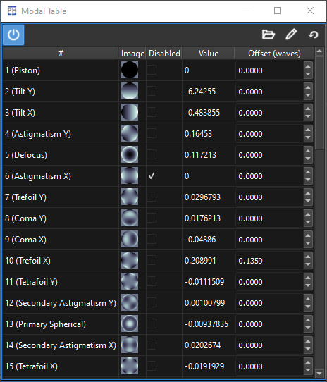

:icons: 
:iconsdir: /icons/

The *modal table* widget presents the current state of the modal reconstruction as a grid, with each row representing a mode.

[cols="1,3"]
|===
|#
|Mode index.

|Image
|Mode wavefront representation.

|Disabled
|Enable/disable the mode.

|Value
|Current measured mode.

|Offset
|Mode offset.
|===

include::table.adoc[lines=5..-1]

{}
The modal widgets will become enabled once a reference is taken.
{}