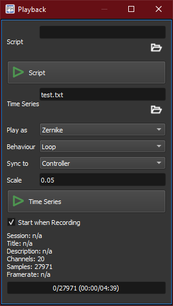

:icons: 
:iconsdir: /icons/

The *playback widget* offers an interface to either reproduce a *time series* or execute a *script*.

{}
The script engine is *deprecated* in favor of the more flexible *networking* interface.
{}

[%autowidth]
|===
|Item |Description

|icon:folder[] Script
|Open a script file. 

|icon:script_start[] Script
|Starts the script engine with the selected script file.

|icon:folder[] Time Series
|Open a time series file.

{}
When a time series is loaded, the *statistics* section displays informations about the decoded data..
{}

|Play as
a|Target of the time series file:

[%autowidth]
!===
!Item !Description

!Zernike !Play the time series as Zernike offsets;
!Actuators !Play the time series as actuators offsets.
!===

|Behaviour
a|Determines the action after the time series finishes:

[%autowidth]
!===
!Item !Description

!One-Shot !Do not replay the time series;
!Loop !Replay the time series.
!===

|Sync to
a|Determines the clock to which the time series is synchronized:

[%autowidth]
!===
!Item !Description

!Custom !Set the custom clock frequency;
!Controller !Use the control loop clock;
!Timestamps !*(unsupported)* Advance each sample according to its associated timestamp.
!===

|Scale
|Scale of the time series. At 1, the time series is not scaled.

|icon:script_start[] Time Series
|Play the time series. Click the button again to stop the time series.

|Start when Recording
|Let the time series start right after a log operation started.
|===