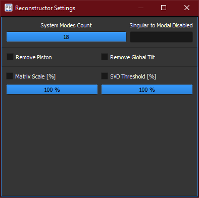

:icons: 
:iconsdir: ./icons/

The *reconstructor* widget processes the AO interaction matrix acquired with the calibration or loaded from disk. 

[%autowidth]
|===
|Item |Description

|System Modes Count
|Number of system modes to consider for the reconstructor. 

|Singular to Modal Disabled
|Indexes of the modes to remove from the reconstructor matrix.

* Format example: "2,5,7-11" means that the modes at index 2, 5, and in the interval between 7 and 11 are removed.

|Remove Piston
|Removes the unmeasurable piston mode from the reconstructor, minimizing the actuators effort into reconstructing the wavefront. On some AO systems it might be counter-productive, as some modes mimic the piston to be correctly represented.

|Remove Global Tilt
|Removes the tip-tilt modes from the reconstructor.

|Matrix Scale
|Scale te reconstruction matrix. Useful when the setup in which the AO system is calibrated differs from the setup in which the AO system is operative. 

|SVD Threshold
|Percentage of the amplitude of the system modes below which are removed from the reconstructor.
|===