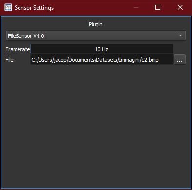

The *sensor* widget manages the interface between PhotonLoop and a connected camera.
Available cameras are listed as xref:../plugins#_sensor_plugins[*plugins*], with each plugin exposing different options.
