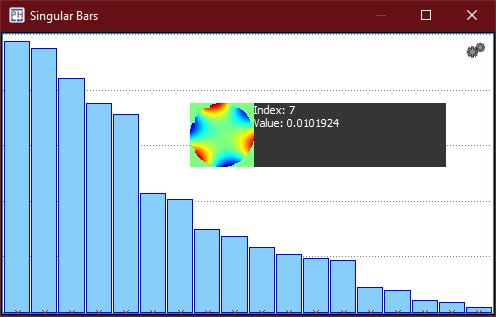

:icons:
:iconsdir: /icons/

The *singular bars* widget gives the user a graphical representation of the singular values extracted from the Singular Value Decomposition of the interaction matrix. 
Each bar represents an individual *singular mode*, with the height determined by its *singular value*.

A singular mode is *selected* when hovering over its corresponding bar. While hovering, the *preview snippet* shows the singular value and the wavefront representation of the currently selected index.

Within the *singular bars* widget it is possible to *cut* the number of considered singular modes. Clicking the *left* mouse button over a singular mode sets it as the cutoff point.

{}
Singular modes represented by *smaller* singular values are more *difficult* to achieve (either because they are noisy or require more dynamics). If the closed loop performance is poor, consider to *cutoff* such modes.

On the other hand, cutting off too many modes will *reduce* the spatial representation of the AO system.
{}

{}
The system widgets will become enabled once an interaction matrix has been *acquired*.
{}

include::bars.adoc[lines=5..-1]
