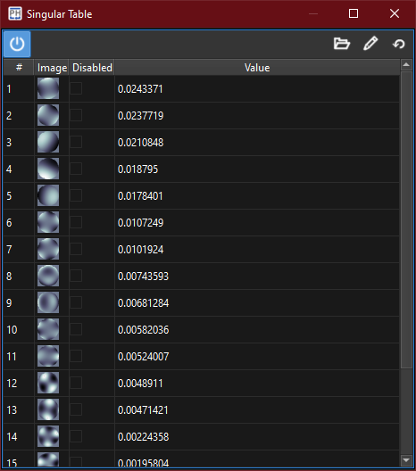

:icons:
:iconsdir: /icons/

The *singular table* widget lists the singular values in a table, with each row representing a singular mode.

{}
The system widgets will become enabled once an interaction matrix has been *acquired*.
{}

[%autowidth]
|===
|Item |Description

|#
|Singular mode index.

|Image
|Singular mode wavefront representation.

|Value
|Singular value.
|===

include::content/widgets/table.adoc[lines=5..-1]
