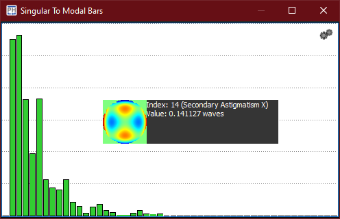

:icons:
:iconsdir: /icons/

The *singular to modal bars* widget gives an indication of the maximum modal amplitudes achievable by the AO system.

{}
The displayed amplitude is referred to *individual* modes.
{}

A mode is *selected* when hovering over its corresponding bar. While hovering, the *preview snippet* shows the numerical values and actuator response of the currently selected mode index.

Within the *singular to modal bars* widget it is possible to *toggle* the selected modes from the interaction matrix:

* Clicking the *left* mouse button disables the mode. 
* Clicking the *right* mouse button enables the mode. 

include::content/widgets/bars.adoc[lines=5..-1]

{}
The system widgets will become enabled once an interaction matrix has been *acquired*.
{}
