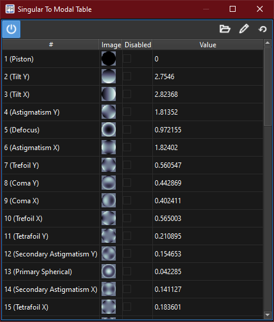

:icons:
:iconsdir: /icons/

The *singular to modal table* widget lists the modes that can be observed and controlled by the current AO calibration, along with their amplitudes.

include::content/widgets/table.adoc[lines=5..-1]

{}
The system widgets will become enabled once an interaction matrix has been *acquired*.
{}
