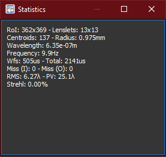

The *statistics* widget shows textual real-time informations about the wavefront measurements.

[%autowidth]
|===
|Item |Description

|RoI
|Size of the Region of Interest set into the viewfinder.

|Lenslets
|Number of lenslets in the grid inscribed into the RoI.

|Centroids
|Number of valid centroids detected by the WFS.

|Radius
|Radius of the virtual circular aperture inscribed into the RoI.

|Wavelength
|Wavelength of the incoming beam.

|Frequency
|Camera frequency.

|Wfs
|Computational latency of the WFS extraction routine.

|Total
|Roundtrip latency of the AO controller.

|Miss (I)
|Number of input frames skipped, expressed in frames per seconds. If greater than zero, it is suggested to reduce the computational complexity.

|Miss (O)
|Number of output commands skipped, expressed in frames per seconds. If greater than zero, the WFC driver is unable to process all the outgoing commands. 

|RMS
|RMS of the measured wavefront, expressed in waves.

|PV
|Peak to Valley of the measured wavefront, expressed in waves.

|Strehl
|Strehl ratio of the measured wavefront, expressed in waves.
|===