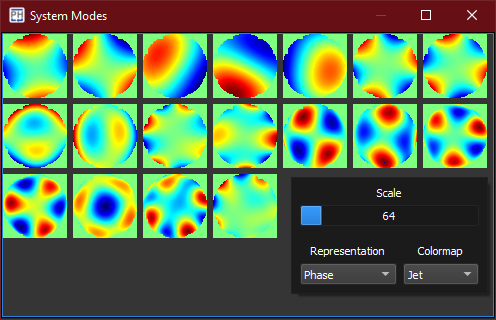

:icons:
:iconsdir: /icons/

The *system modes* widget shows the wavefront representation of all singular modes.

Clicking with the *right* mouse button pops up the display *settings*:

[%autowidth]
|===
|Item |Description

|Scale
|Determines the zoom level of the wavefront representation.

|Representation
|Determines how the wavefront relative to the selected bar is displayed into the preview snippet.

|Colormap
|Determines the colormap of the wavefront.
|=== 

{}
The system widgets will become enabled once an interaction matrix has been *acquired*.
{}