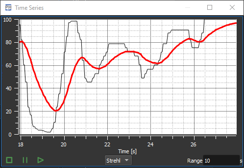
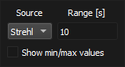

---
title: Time Series
date: 02/09/2021
draft: false

categories:
    - "category1"
tags:
    - "tag1"
    - "tag2"
---

:icons: 
:iconsdir: /icons/

The *time series* widget displays the evolution over time of a scalar variable:

* The *black* curve represents the current measurement;
* The *red* thick curve represents the averaged current measurement.

[%autowidth]
|===
|Item |Description

|icon:script_stop[]
|Resets the time series and the autoscale.

|icon:pause[]
|Freezes the time series.

|icon:script_start[]
|Start the time series.

|icon:settings[]
|Show the time series settings.
|===

== Settings

[%autowidth]
|===
|Item |Description

|Source
|Time series source.

|Range
|Period of time to display at once.

|===