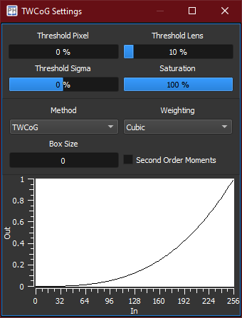

:icons: 
:iconsdir: ./icons/

The *TWCoG* widget exposes the parameters of the Thresholded Weighted Center of Gravity (TWCoG) algorithm implemented into the WFS centroids extraction routine.

The *plot* shows the pixel intensity transformation map.

[%autowidth]
|===
|Item |Description

|Threshold Pixel
|Percentage of the pixel intensity below which the pixel is not considered.

|Threshold Lens
|Percentage of the sum of the pixel intensities in a lenslet below which the lenslet is invalid.

|Threshold Sigma
|Variance of the Gaussian shape applied to the threshold pixel values. The Gaussian is centered at the center of the RoI, and affects the threshold on a per-lenslet basis.

|Saturation
|Percentage of the pixel intensity above which the pixel intensity is maximum.

|Method
|Currently only the TWCoG method is implemented.

|Weighting
a|Weighting law of the pixel intensities.

[%autowidth]
!===
!Item !Description

!Linear !The intensity is not weighted;
!Quadratic !The intensity value is squared;
!Cubic !The intensity value is elevated at the power of 3.
!===

Weighting the pixel intensities emphatizes high intensity values, leading to better signal to noise ratio. 
However, the measurement will no longer be linear.

|Box Size
|Lenslet margin outside which pixels are not considered.

|Second Order Moments
|Calculate second order moments.
|===