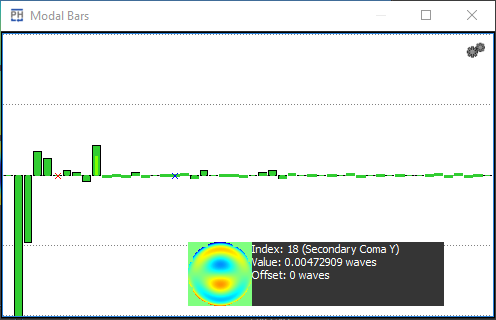
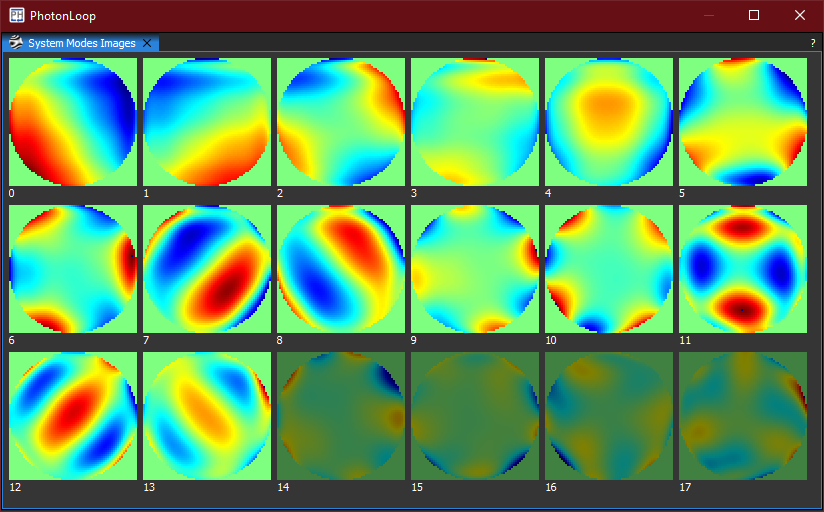

:icons: 
:iconsdir: /icons/

The *Values* widgets are a family of widgets comprised of:

* Bars widget;
* Table widget;
* Image grid widget.

The goal of each widget is to expose values in a meaningful and interactive way. 

== Bars Widget

The *bars* widget shows values and offsets as interactive histogram plots: 

* The *wide* bars display the current values;
* The *slim* bars display the current offsets;
* The *red* crosses indicate disabled indexes.

An index is *selected* when hovering over its corresponding bar with the mouse cursor. While hovering, the *preview snippet* shows the numerical values and, if available, the image of the currently selected index.

Within the *bars* widget it is possible to directly control the *offsets* of the currently selected index:

* Clicking the *left* mouse button changes the offset. 
* Clicking the *right* mouse button zeroes the offset. 
* Clicking the *middle* mouse button enables/disables the index.

{}
It is possible to keep the mouse button *depressed* to keep editing the offset or reset multiple offsets.
{}

{}
Offsets and disabled indexes may not be shown due to the values nature.
{}

=== Bars Widget Settings

image:modalbarssettings.png[]

[%autowidth]
|===
|Item |Description

|Scale*
|Scale of the Y axis.

|Autoscale*
|Scales the bars according to the minimum/maximum values.

|Show Values
|Adds a vertical numbered axis on the left of the bars.

|Representation
|Determines how the wavefront relative to the selected bar is displayed into the preview snippet.

|Colormap
|Determines the colormap of the wavefront. 
|===

Elements marked with (*) may not be shown depending on the values nature.

== Table Widget

image:modaltable.png[]

The *table* widget shows values and offsets as a grid, with each row representing a value index.

[cols="1,3"]
|===
|Item |Description

|#
|Index with name*.

|Image*
|Index image (if available).

|Disabled*
|Enable/disable the index.

|Value
|Current value.

|Offset*
|Current offset.
|===

Elements marked with (*) may not be shown depending on the values nature.

=== Table Widget Settings

The table view is useful to enter precise values for the desired indexes. There are also some utilities that can be exploited to ease the table editing:

[cols="1,3"]
|===
|Item |Description

|icon:power[]
|Enable/Disable offsets.

|icon:folder[]
|Load offsets from file.

|icon:pencil[]
|Save current dataset to file.

|icon:restoreDefault[]
|Set to zero all offsets.
|===

== Image Grid Widget

The *image grid* widget shows a grid of index images having values and offsets as captions.

=== Image Grid Widget Settings

Clicking with the *right* mouse button pops up the display *settings*:

image:imagegridsettings.png[]

[%autowidth]
|===
|Item |Description

|Representation
|Determines how the wavefront relative to the selected bar is displayed into the preview snippet.

|Colormap
|Determines the colormap of the wavefront.

|Scale
|Determines the zoom level of the wavefront representation.
|=== 