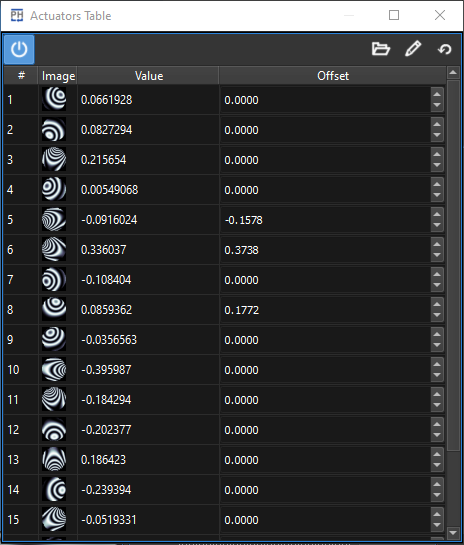
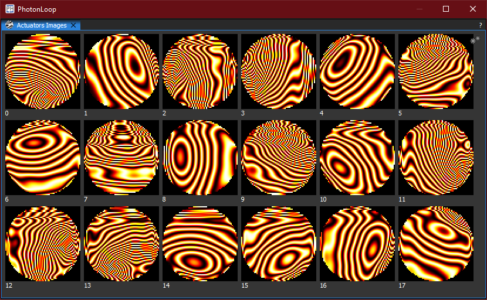

:icons: 
:iconsdir: /icons/

[cols="a,a,a", frame=none, grid=none]
|===
| image:actuatorsbars.png[]
| 
| 
|===

The *actuators* widgets gives the user a graphical representation of the actual state of the WFC actuators: 

* The values represent the *command vector* issued to the WFC;
* The offsets represent the *command offsets*;
* The images are the *actuators response* to the calibration.

It is not possible to disable the actuators.

{}
The actuators widgets will become enabled once a WFC plugin is succesfully *opened*.
{}
{}
The actuators response images are only shown after the AO system is *calibrated*.
{}

The Y range and baseline are fixed and are determined by the WFC specifications (minimum, maximum and center).

Refer to the xref:offsetwidgets.adoc[*Offset* widgets] for how to interact with the widgets.
