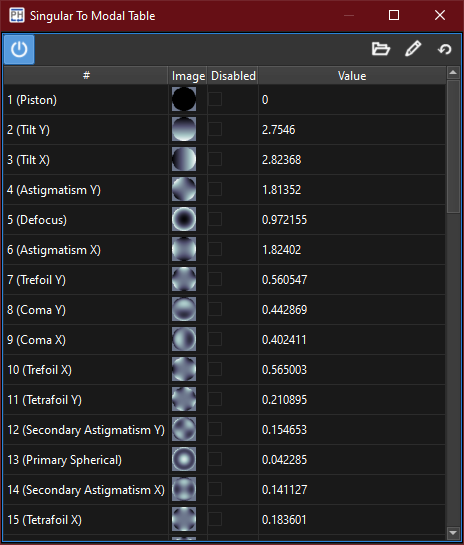

:icons:
:iconsdir: /icons/

[cols="a,a", frame=none, grid=none]
|===
| image:singulartomodalbars.png[]
| 
|===

The *singular to modal bars* widgets gives the user a graphical representation of the modes that can be observed and controlled by the current AO calibration along with their theoretical maximum amplitudes achievable by the AO setup:

* The values represent the *maximum* amplitude achievable for a given index;
* The disabled values represent which term has been *geometrically removed* from the calibration;
* The images are the *modal wavefronts*.

{}
The system widgets will become enabled once an interaction matrix has been *acquired*.
{}

The *singular to modal table* widget lists the modes that can be observed and controlled by the current AO calibration, along with their amplitudes.

{}
The system widgets will become enabled once an interaction matrix has been *acquired*.
{}

Refer to the xref:offsetwidgets.adoc[*Offset* widgets] for how to interact with the widgets.