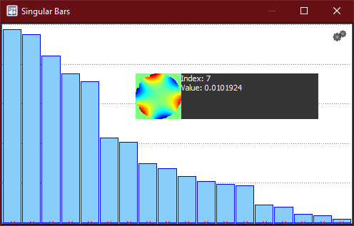
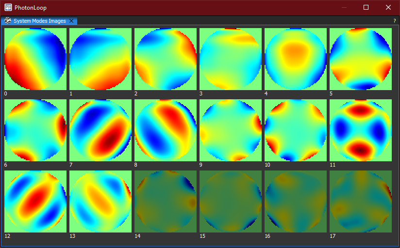

:icons:
:iconsdir: /icons/

[cols="a,a,a", frame=none, grid=none]
|===
| 
| image:singulartable.png[]
| 
|===

The *singular* widget gives the user a graphical representation of the singular values extracted from the Singular Value Decomposition of the interaction matrix:

* The values represent the *singular value amplitudes* with respect to their *singular modes*;
* The disabled values represent the *cutoff*;
* The image represent the *wavefront visualization* of each singular mode.

{}
Singular modes represented by *smaller* singular values are more *difficult* to achieve (either because they are noisy or require more dynamics). If the closed loop performance is poor, consider to *cutoff* such modes.
On the other hand, cutting off too many modes will *reduce* the spatial representation of the AO system.
{}

{}
The system widgets will become enabled once an interaction matrix has been *acquired*.
{}

Refer to the xref:offsetwidgets.adoc[*Offset* widgets] for how to interact with the widgets.