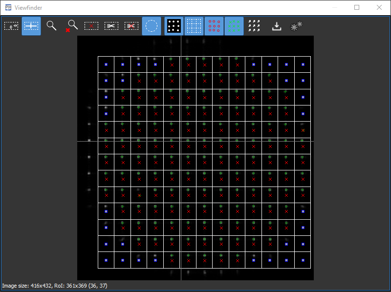
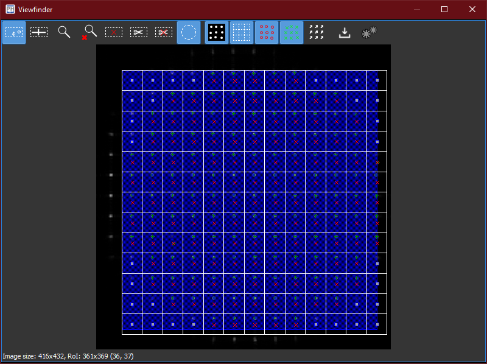
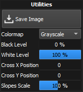

:icons: image
:iconsdir: /icons/

With the *viewfinder* widget it is possible to display the sensor image and set the *RoI*.

[%autowidth]
|===
|Item |Description

|icon:grid_resize[] Draw tool
|When this tool is selected, it is possible to edit the Region of Interest (RoI) of the image.

|icon:grid_cross[] Cross tool
|When this tool is selected, a cross can be set and shown over the image.

|icon:gridZoom[] Zoom tool
|When this tool is selected, it is possible to zoom into the selected region of the image.

|icon:grid_reset_zoom[] Zoom reset
|Resets the zoom level to its default value.

|icon:centroids_remove[] Remove centroids tool
|When this tool is selected, it is possible to disable/enable lenslets within the RoI.

|icon:grid_crop[] Crop image
|Crops the sensor image to the boundaries defined by the RoI.

|icon:wfs_full[] Uncrop image
|Restore the image to its original size.

|icon:grid_circle[] Circular aperture
|Disables the centroids outside the circle inscribed into the RoI. 

|icon:grid_ccd[] Show image
|Show/hide image.

|icon:grid[] Show grid
|Show/hide grid.

|icon:grid_ref[] Show reference
|Show/hide reference centroids.

|icon:grid_main[] Show centroids
|Show/hide measured centroids.

|icon:grid_quiver[] Show slopes
|Show/hide measured slopes.

|icon:save[] Save image
|Save the current image to file.

|icon:settings[] Settings
|Show additional settings.
|===

== Drawing the RoI

The RoI can be manipulated using the *draw tool* icon:grid_resize[]. 
Hovering over the image reveals the RoI *boundaries* (dashed lines):

* Clicking and dragging the mouse *outside* the RoI discards the currently set RoI and begins drawing a new one;
* Clicking and dragging the mouse on the *edges* or *corners* of the RoI (highlighted in blue) resizes the RoI;
* Clicking and dragging the mouse *inside* the RoI (highlighted in blue) moves the RoI.

== Adjusting the image display

The viewfinder additional *settings* icon:settings[width=16] are used to control how the image is displayed.

[%autowidth]
|===
|Item |Description

|Black level
|Percentage of the maximum pixel intensity corresponding to the minimum colormap value.

|White level
|Percentage of the maximum pixel intensity corresponding to the maximum colormap value.

|Colormap
|Image colormap.

|Slopes Scale
|Length ratio of the displayed slopes.
|===