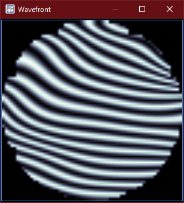
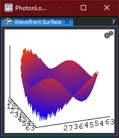
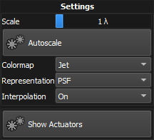
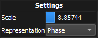

:icons: 
:iconsdir: /icons/

The *wavefront* widgets show the wavefront reconstructed from the measured modal terms.
Refer to the *modal settings* widget to set the shape and resolution of the reconstructed wavefront.

{}
The widgets will be enabled once a valid *reference* has been taken.
{}

== Adjusting the wavefront display 

Hovering over the wavefront widget reveals the icon:settings[] settings button that can be clicked to show the widget settings.

[%autowidth]
|===
|Item |Description

|Scale
|Scale of the colormap (in waves), from zero to either direction.
If the wavefront amplitude is greater/lower than the scale, the colormap wraps.
Does not apply when the representation type is Interferogram.

|Autoscale
|Dynamically scales the colormap to cover the entire amplitude of the wavefront.
Does not apply when the representation type is Interferogram.

|Colormap
|Colormap of the wavefront.

|Representation
a|Representation of the wavefront:

[%autowidth]
!===
!Item !Description

!Phase !Phase representation;
!Interferogram !Interferogram representation;
!Smooth Interferogram !Interferogram representation, with additional smoothing (computationally expensive);
!PSF !Point Spread Function representation.
!===

|Interpolation
|Enables linear interpolation.

|Show Actuators
|Show the actuators positions and values over the wavefront surface.
|===

{}
The actuators positions are only available after a valid *calibration* has been performed/loaded.
{}

== Adjusting the wavefront surface display

Hovering over the wavefront surface widget reveals the icon:settings[] settings button that can be clicked to show the widget settings.

[%autowidth]
|===
|Item |Description

|Scale
|Z-axis scale of the displayed wavefront

|Representation
a|Wavefront representation:

[%autowidth]
!===
!Item !Description

!Phase !Phase representation;
!PSF !Point Spread Function representation.
!===
|===

The wavefront surface widget can also be manipulated with mouse and keyboard:

[%autowidth]
|===
|Item |Description

|Left mouse button
|Rotation around X and Z axis

|Left mouse button + SHIFT
|Rotation around Y axis

|Left mouse button + CTRL
|Pan

|Left mouse button + ALT
|Stretch

|Mouse wheel
|Zoom

|Mouse wheel + SHIFT
|Z-axis scale
|===