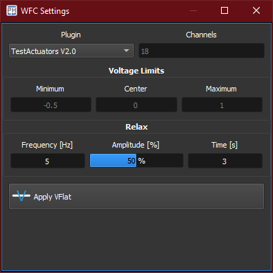

:icons: 
:iconsdir: ./icons/

The WaveFront Corrector *WFC* widget manages the interface between PhotonLoop and a connected wavefront corrector.
Available correctors are listed as xref:..//plugins#_wfc_plugins[*plugins*].

[%autowidth]
|===
|Item |Description

|Plugin
|Selects the desired plugin.

|Channels
|Number of channels to use.

{}
Some plugins automatically populate this field with the correct number of actuators.
{}

|Minimum
|Minimum command value to be issued to the wavefront corrector.

|Center
|Center value of the wavefront corrector command. This will set the actuators *zero*.

|Maximum
|Maximum command value to be issued to the wavefront corrector.

|Frequency
|Frequency of the sinusoidal function used in the anti-hysterisys routine.

|Amplitude
|Amplitude of the sinusoidal function used in the anti-hysterisys routine.

|Time
|Decay time of the sinusoidal function used in the anti-hysterisys routine.

|Apply VFlat
|If available, applies the command required to *flatten* the wavefront corrector.
|===