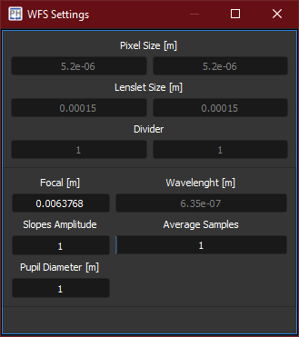

The WaveFront Sensor *WFS* widget defines the parameters to build the *centroids extraction grid* and the *modal reconstruction*.

[%autowidth]
|===
|Item |Description

|Pixel Size [m]
|Physical size of the camera pixels.

|Lenslet Size [m]
|Physical size of the lenslets of the Shack-Hartmann lenslet array.

|Divider
|If the camera operates in sub-sampling or binning mode, the pixel size must be updated accordingly by setting the divider (integer value).

|Focal [m]
|Distance from the lenslet array to the pixel array.

|Wavelength [m]
|Wavelength of the measured wavefront.

|Slopes Amplitude
|Multiplier for the measured slopes values.

|Average Samples
|Processes the slopes through a moving average filter.

|Pupil Diameter [m]
|Aperture diameter.
|===
