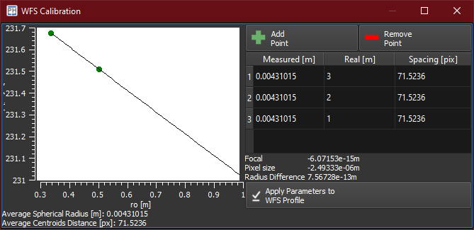

The wavefront sensor is delivered with the calibration file that can be loaded in PhotonLoop, and contains all the measured specifications. The calibration consists in a series of measurements of a spherical wavefront generated by a laser source at different distances between the SHWFS and source. The setup is very simple:

image:/img/image66.png[]

Measure the spherical wavefront as described in Section 7. Draw a grid about 20x20 in dimensions, the maximum wavefront curvature is in the closest position to the source so be sure that the spots in the border of the considered aperture are inside their cell. For this measurement use a square aperture, DO NOT use the circular aperture option.

PHOTONLOOP has a WFS calibration widget in the Calibration Tab of WFS Parameters window, to open the window click on image:/img/image27.png[]. To add a point, click on Add Point, insert the measured distances between source and SHWFS (you can use a simple ruler) and press OK. In the table you will see the measured curvature radius and the real one written down before. Take around ten acquisitions at different distances starting from 0.20 m to 1 m.

image:/img/image67.png[]

PHOTONLOOP try to interpolate the data when you add the measurements, all the points should stay along a straight line. Press Apply Parameters to WFS Profile when you finish the acquisition set. Now you can save the profile with the save button in the WFS Tab of Settings Tab.